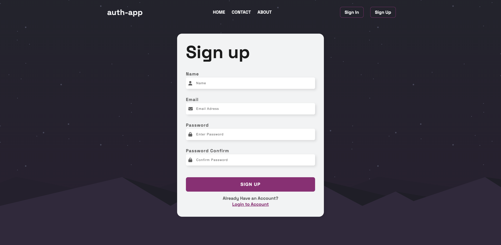

# Auth-App

## Descrizione

Auth-App è un'applicazione di autenticazione che consente agli utenti di registrarsi, effettuare il login, verificare l'email, reimpostare la password, e gestire la propria sessione in modo sicuro tramite token JWT. Implementa funzionalità di protezione delle rotte, gestione della sessione utente tramite cookie e verifica dell'account tramite email.

## Tecnologie utilizzate

- **Node.js**: Ambiente di esecuzione per il server.
- **Express**: Framework web per gestire le richieste HTTP.
- **JWT (JSON Web Tokens)**: Autenticazione tramite token.
- **MongoDB (Mongoose)**: Database per memorizzare gli utenti e le loro informazioni.
- **bcryptjs**: Hashing delle password per la sicurezza.
- **cookie-parser**: Middleware per la gestione dei cookie.
- **dotenv**: Gestione delle variabili d'ambiente.
- **validator**: Per la validazione dei dati in ingresso.
- **ms**: Per la gestione delle durate temporali nei token.
- **node-cron**: Per la pianificazione di task ricorrenti (se necessario).
- **express-mongo-sanitize**: Per proteggere da attacchi di NoSQL injection.
- **express-rate-limit**: Per limitare il numero di richieste e proteggere dalle aggressioni di tipo DDoS.
- **helmet**: Per aumentare la sicurezza HTTP.
- **hpp**: Protezione contro l'HTTP Parameter Pollution.
- **morgan**: Middleware per il logging delle richieste HTTP.

## 📸 Screenshot

## 🔗 Link al Progetto

[**Demo Online**](https://thomas-mach.github.io/auth-app-frontend/)
